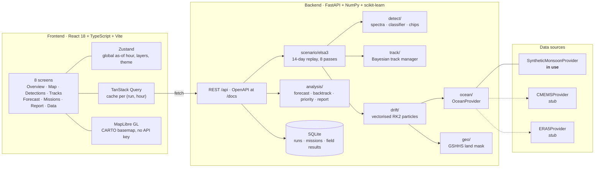

# DriftSight

**Detect once, track always.** Satellite debris detection, ocean drift tracking and
clean-up tasking for floating marine plastic — built around the **MSC ELSA 3**
container ship that sank off Kerala on **25 May 2025** and spilled plastic
nurdles that washed ashore from Alappuzha down to Kanyakumari and round to
Rameswaram.

> **Prototype.** The satellite imagery and the ocean fields in this build are
> *simulated*. No number this app shows is a measurement. Every screen says so,
> and [docs/real-data.md](docs/real-data.md) is the plan for changing that.

---

## The idea

A single satellite image cannot tell plastic from sun glint, whitecap foam or a
Sargassum raft. Published Sentinel-2 detectors get fooled by all three. So
DriftSight does not try to decide from one image.

| | |
|---|---|
| **Detect** | An AI classifier flags suspected plastic in each clear pass. |
| **Track** | Every detection seeds a cloud of virtual particles that drifts with the currents and the wind. |
| **Confirm** | At the next clear image: found near the predicted spot → confidence up. Missing → confidence down. Under cloud → keep predicting. |

Real debris keeps re-appearing where the currents put it, and gets **confirmed**.
Look-alikes do not, and get **rejected** before anyone launches a boat.

Pellets are a separate problem: a nurdle is a few millimetres across, so nothing
in orbit will ever see one. They are **forecast** forward from the wreck instead,
which is what lets a beach be warned before the pellets arrive.

---

## Architecture



**Loop that makes it better over time:** a completed mission records
`debris_found` / `nothing_found`, which is stored as a labelled sample. Those
labels are what a retrained detector learns from.

---

## Quick start

Needs **Python 3.11+** and **Node 20+**.

```bash
make dev
```

* Console — <http://localhost:5173>
* API docs — <http://localhost:8000/docs>

Sign in with either demo account (both password `demo123`):

| Account | Role | Sees |
|---|---|---|
| `analyst@incois.demo` | analyst | everything |
| `field@coastguard.demo` | field team | only its own missions |

These are published demo credentials for a prototype, not secrets.

```bash
make test      # pytest (engine parity, detector, tracker, API) + tsc
make build     # production build of the console
make help      # every target
```

### Docker

```bash
docker compose up --build
```

Console on <http://localhost:8080>, API on <http://localhost:8000>. nginx proxies
`/api`, `/docs` and `/openapi.json` to the API container, so the browser talks to
one origin. The SQLite file lives in a named volume.

---

## 60-second demo script

Open the **Operations map** and press play. The default time is 1 Jun, 12:00 IST.

| Time | What to point at |
|---|---|
| **27 May** | First clear Sentinel-2 pass. The AI flags three candidates — **A**, **B**, **C**. Nothing is confirmed yet; one image is not evidence. |
| **28–29 May** | Two passes, both fully clouded. Confidence barely moves and the particle clouds keep drifting — *the model is still predicting when the sensor is blind*. |
| **30 May** | Clear pass. **A** and **C** turn up 13.7 km and 13.6 km from the forecast, inside the gate → both **CONFIRMED as real debris**. A new candidate **D** appears. |
| **1 Jun** | Partly clouded. **D** is not where the currents put it → **REJECTED as a look-alike**. (It was sun glint.) |
| **4 Jun** | **B** misses again → **REJECTED**. Two boats' worth of false tasking never left harbour. |
| **Landfall forecast** | Pellets reach **Kanyakumari on 29 May, 04:00 IST** — 1.3 days before the 30 May beach survey that rated pellet pollution "Very High". |

Then open a confirmed patch and press **Trace to source**: the drift model runs
backwards and passes 7.5 km from the wreck, an 84 % match.

Turn on **Hidden truth (demo)** in the layer panel to check the verdicts against
the ground truth the detector never sees.

---

## What the replay produces

Defaults: gate 16 km, confirm 0.80, reject 0.25, cloud decay 0.90, 1,600 pellets,
seed 2025. Deterministic — the same numbers every run, on every machine.

| | |
|---|---|
| AI detections | 11 across 8 passes (4 usable, 4 clouded) |
| Real debris fields confirmed | **2** |
| Look-alikes rejected | **2** (both sun glint) |
| False alarms ever confirmed | **0** |
| Mean forecast error before a fix | 8.6 km |
| First pellets at Kanyakumari | 29 May, 04:00 IST — **before 30 May** |
| Reported districts reached | 3 of 5 |
| Detector held-out accuracy | 96.8 % |
| Full 14-day run | ~0.4 s |

These are asserted in `backend/tests/test_engine_parity.py`, so the story cannot
silently drift.

The two reported districts the run misses — Alappuzha and Ramanathapuram — are
the honest limit of a synthetic circulation, not a bug to paper over. Real
INCOIS/CMEMS fields are what fix them.

---

## Screens

**Overview** · **Operations map** · **Detections** · **Tracks** · **Landfall forecast** · **Missions** · **Situation report** · **Data & models**

All eight share one as-of clock in the top bar, so moving time on any screen moves
it everywhere. The demo script above walks the ones that carry the argument.

---

## API

31 endpoints under `/api`, documented and executable at **`/docs`** — sign-in,
incident and pass schedule, runs, per-hour frames, detections, tracks and source
tracing, landfall forecast, priority zones, missions, GeoJSON and PDF export,
detector metrics, and GeoTIFF upload.

**Timebase.** Hour 0 is 25 May 2025 00:00 IST; the replay is 336 hours. Passes at
11:00 IST on 27 May, 28 May (clouded), 29 May (clouded), 30 May, 1 Jun (partial),
2 Jun (clouded), 4 Jun and 6 Jun.

---

## How it works

**Detector** (`app/detect/`). Six Sentinel-2 bands plus FDI, NDVI and NDWI into a
four-class logistic regression — debris / foam / algae / water — trained on
synthetic labelled spectra, 96.8 % held out. Per chip it classifies every pixel of
a 24×24 window (240 m a side) and reports the largest 4-connected blob above
P = 0.5.

The regularisation is deliberately strong. An unregularised fit separates sun
glint from plastic almost perfectly, which no real single-image detector does —
and a detector that is never wrong makes tracking pointless.

**Drift** (`app/drift/`, `app/ocean/`). Hourly RK2 advection through an
`OceanProvider`, plus a per-particle windage fraction of the 10 m wind, plus a
random walk; particles beach on a 0.01° GSHHS land mask and stop. **Debris drifts
through one parameter set and DriftSight predicts with another**, so the tracker
faces a realistic forecast error rather than a perfect model.

**Tracker** (`app/track/`). Nearest-first association inside a gate of
`max(gate_km, 3σ)` — never tighter than the forecast's own spread — then a
likelihood-ratio update on the odds:

```
re-found    ×  4·√(q/(1−q))·exp(−(d/gate)²)     q = detection quality, d = miss distance
missed      ×  0.25
clouded     ×  0.90
```

Above 0.80 confirms, below 0.25 rejects.

**Reproducible to the particle.** A vectorised NumPy port of the reference
prototype's mulberry32 generator makes the replay identical to the original
JavaScript engine — which is how `test_engine_parity.py` can assert the exact
story rather than a tolerance.

---

## Real data

The replay runs on simulated imagery and a simulated ocean — nothing here talks
to a satellite archive or an ocean model. **[docs/real-data.md](docs/real-data.md)**
is the swap-in plan: Sentinel-2 / Sentinel-1 imagery, CMEMS and INCOIS currents,
ERA5 winds, and a U-Net trained on MARIDA + MADOS, each named against the function
or class it replaces.

---

## Notes

* On macOS with NumPy 2.x + Apple Accelerate you may see a
  `RuntimeWarning: divide by zero encountered in matmul` at startup. It is a known
  false positive from Accelerate's BLAS setting FP flags spuriously; results are
  unaffected and the Linux containers do not show it.
* The map needs network access for the CARTO basemap. If it cannot be reached,
  DriftSight falls back to drawing the GSHHS coastline it already holds and says
  so on the map.

## Credits & sources

Coastline and land mask from **GSHHS**. Basemap tiles © **CARTO**, © **OpenStreetMap**
contributors. Incident details and reported landfall from INCOIS, contemporary
news reporting, and the *Marine Pollution Bulletin* (2025) beach survey at
Kanyakumari on 30 May 2025. Spectral indices after Biermann et al. (FDI).
MARIDA and MADOS are named as the production training sets; neither is used here.
